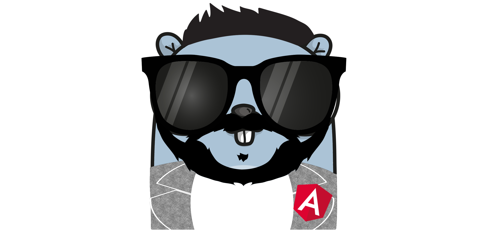

## 👋 Hi, i'am Leandro Freire 💻

I am a big lover of technology and its challenges and the problems they solve
I currently work with user support, network infrastructure and sysadmin, but I have been studying web development for at least 6 years. today I seek to migrate from support to development.

I am fascinated to solve problems with technology, I am hungry to discover new things just like a child who disassembled my toys to know how it worked.

### experience
right when i started studying web development (ETEC - Technical school center paula souza) i did a freelance that i believe i got a lot of knowledge, it was an affiliate system for university transportation, at the time i developed the system with cakephp + mysql + redis + aws s3 for api and angular 2 on the front, the system registered students and issued a ticket that referred to transporting it to college (transfer) and still ran on docker swarm, I was motivated.
 - Angular2+
 - Cakephp
 - Nodejs
 - Go
 - Docker
 - AWS
 - Azure
 - Firebase

### now
to this day I am still studying, I am a golang lover and I will be very happy to be part of your team.

I want to feel motivated again.

